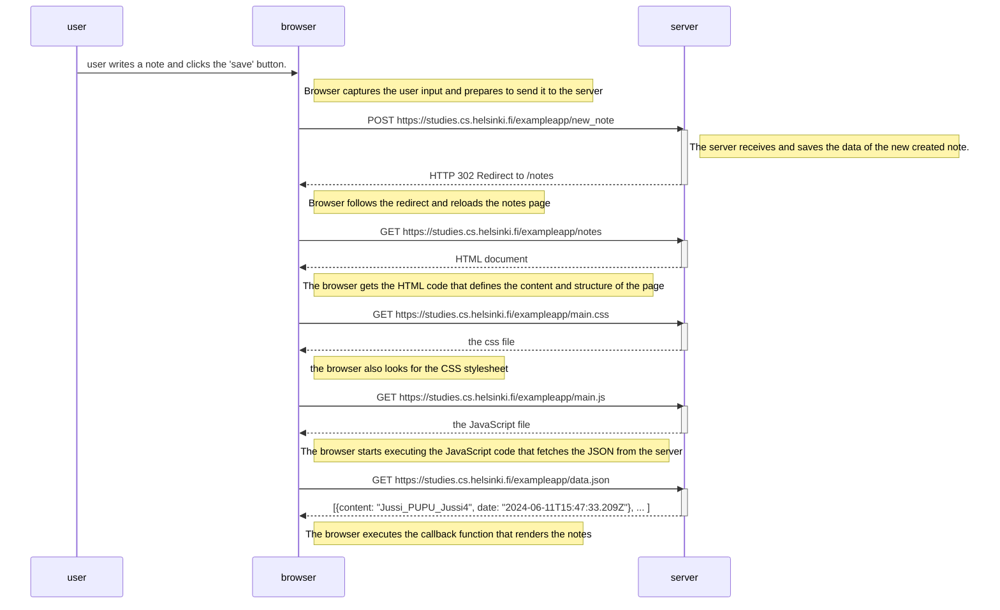

```mermaid

sequenceDiagram
    participant user
    participant browser
    participant server

    user->>browser: user writes a note and clicks the 'save' button.
    Note right of browser: Browser captures the user input and prepares to send it to the server

    browser->>server: POST https://studies.cs.helsinki.fi/exampleapp/new_note
    activate server
    Note right of server: The server receives and saves the data of the new created note.
    server-->>browser: HTTP 302 Redirect to /notes
    deactivate server

    Note right of browser: Browser follows the redirect and reloads the notes page


    browser->>server: GET https://studies.cs.helsinki.fi/exampleapp/notes
    activate server
    server-->>browser: HTML document
    deactivate server

    Note right of browser:  The browser gets the HTML code that defines the content and structure of the page

    browser->>server: GET https://studies.cs.helsinki.fi/exampleapp/main.css
    activate server
    server-->>browser: the css file
    deactivate server

    Note right of browser:  the browser also looks for the CSS stylesheet

    browser->>server: GET https://studies.cs.helsinki.fi/exampleapp/main.js
    activate server
    server-->>browser: the JavaScript file
    deactivate server

    Note right of browser: The browser starts executing the JavaScript code that fetches the JSON from the server

    browser->>server: GET https://studies.cs.helsinki.fi/exampleapp/data.json
    activate server
    server-->>browser:[{content: "Jussi_PUPU_Jussi4", date: "2024-06-11T15:47:33.209Z"}, ... ]
    deactivate server

    Note right of browser:  The browser executes the callback function that renders the notes

```
