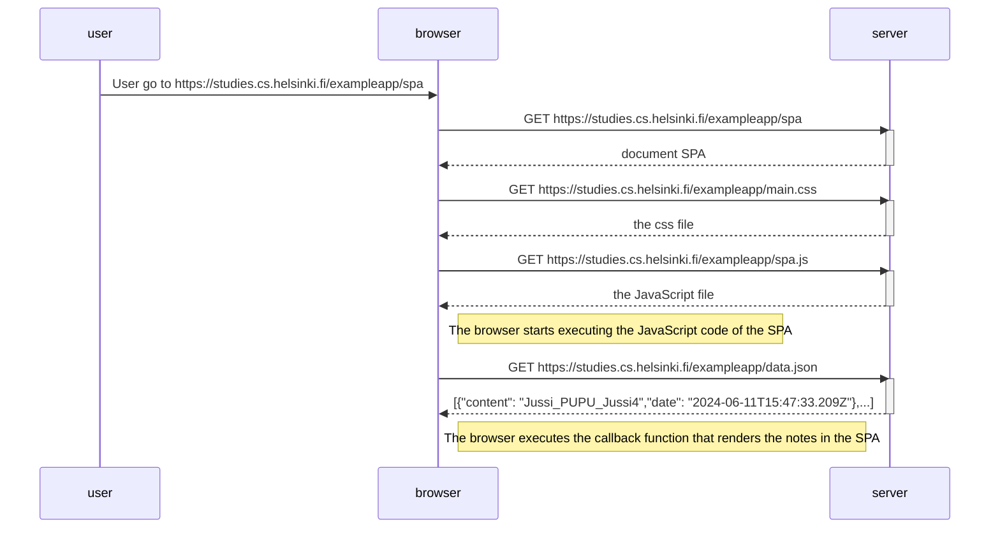

```mermaid
sequenceDiagram
    participant user
    participant browser
    participant server

    user->>browser: User go to https://studies.cs.helsinki.fi/exampleapp/spa
    browser->>server: GET https://studies.cs.helsinki.fi/exampleapp/spa
    activate server
    server-->>browser: document SPA
    deactivate server

    browser->>server: GET https://studies.cs.helsinki.fi/exampleapp/main.css
    activate server
    server-->>browser: the css file
    deactivate server

    browser->>server: GET https://studies.cs.helsinki.fi/exampleapp/spa.js
    activate server
    server-->>browser: the JavaScript file
    deactivate server

    Note right of browser: The browser starts executing the JavaScript code of the SPA

    browser->>server: GET https://studies.cs.helsinki.fi/exampleapp/data.json
    activate server
    server-->>browser:[{"content": "Jussi_PUPU_Jussi4","date": "2024-06-11T15:47:33.209Z"},...]
    deactivate server

    Note right of browser: The browser executes the callback function that renders the notes in the SPA

```
