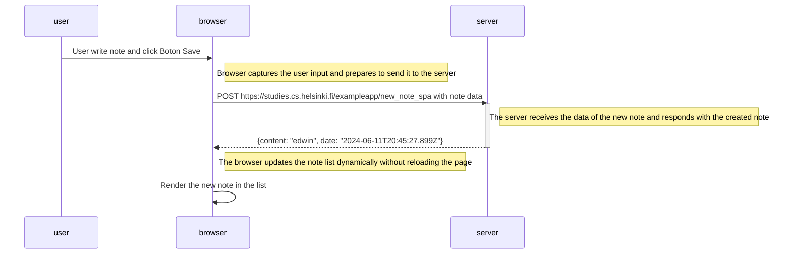

```mermaid
sequenceDiagram
    participant user
    participant browser
    participant server

    user->>browser:User write note and click Boton Save
    Note right of browser: Browser captures the user input and prepares to send it to the server

    browser->>server: POST https://studies.cs.helsinki.fi/exampleapp/new_note_spa with note data
    activate server
    Note right of server: The server receives the data of the new note and responds with the created note
    server-->>browser: {content: "edwin", date: "2024-06-11T20:45:27.899Z"}
    deactivate server

    Note right of browser: The browser updates the note list dynamically without reloading the page
    browser->>browser: Render the new note in the list

```
